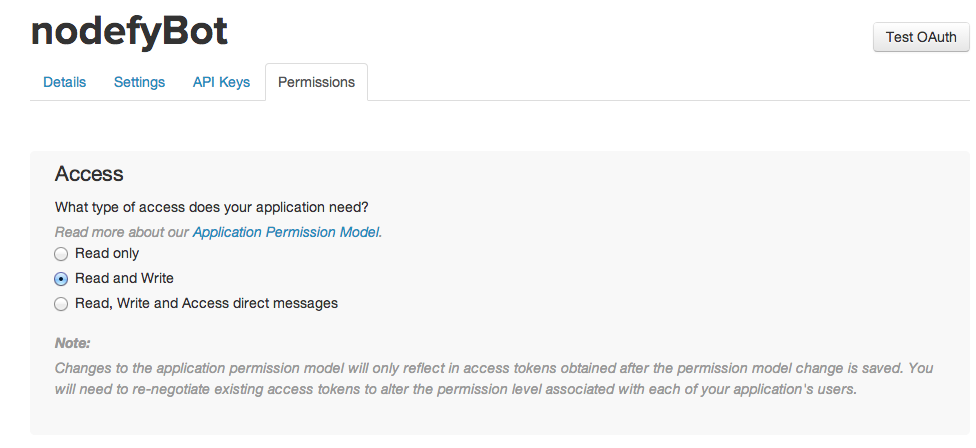

nodefyBot
=========

A node server that responds to tweets!

##Tutorial

###What You Need.
* Node
* Express
* Twitter API Keys
* Wit API Key

###Step 1: Basic Setup

Make a directory called nodefyBot.

```
mkdir nodefyBot
cd nodefyBot
```

If you don't already have node installed, install it from their website or brew install node.

NPM is a package manager that comes with Node, and is super useful for getting all your server 
side dependencies.

We need express for this tutorial, so in your terminal enter the following command.

```js
npm init
npm install --save express
```

I also recommend you use nodemon, which will run your node server and automatically update it when 
it changes. This makes debugging a lot faster and easier.

```js
npm install -g nodemon
```

We install nodemon globally so we can use it from any directory later.

These commands will initialize our directory with a package.json and install all the necessary 
express files. Express makes writing servers with node very easy and takes out a lot of the minutia 
of writing bare node. We will use express for this tutorial.

###Step 2: Establish a basic node server

In your nodefyBot root directory make a file called 'basic-server.js'.

```js
//basic-server.js

//We require express to use all of its useful features, and to make writing node a lot easier
var express = require('express');

//This sets up our app as a basic express server.
var app = express();

//Let's set up a port for our server to listen on
var port = 8300;

//Just one basic server response, to make sure our server is working.
app.get('/*', function(req, res){
  res.send('Hello World');
});

//Let's start up our server listening on our port:
var server = app.listen(port, function(){
  console.log('Basic-server is listening on port ' + port);
});
```
From the root of your nodefyBot directory run 'nodemon basic-server.js' in your terminal.
You should see a console log of 'listening on PORT 8300' in your terminal.

Additionally, with your nodemon still running in your terminal, go to 'localhost:8300' in your 
browser and you should see the response message from your server.

Congratulations, you have spun up a basic express server!

###Step 3: Set up your twitter app.

Go to the <a href='https://apps.twitter.com/'>Twitter App Center</a> and create a new app.

* Give your app a name, this is what @mentions will go to
* Give your app a basic description, whatever you want
* Give your app a website, I just put down <a href='https://kiafathi.com'>my personal blog</a>
* Don't worry about callback for now, not necessary
* Sign the agreement

Once you have created your twitter app, go to the permissions tab and enable read/write permisions.


After enabling the correct permissions, go the the API keys page and keep track of your API keys.
####SPECIAL NOTE: Do not share your api keys online or git commit them. You don't want someone
taking control of your application.